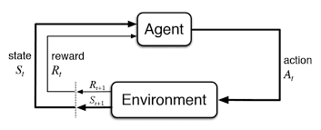

## 1. Introduction

### 1.1 RL Applications

- Robotics & Autonomous Driving
- Game AI
- Finance & Trading
- Recommendation System
- Optimization System

### 1.2 Components of RL

- **State** ($S_t$): State of Environment at time $t$.
- **Action** ($A_t$): Action of Agent based on $S_t$.
- **Environment**: Generate new state $S_{t+1}$ and reward $R_{t+1}$ based on agent's action.
- **Reward** ($R_{t+1}$): Scalar feedback indicating the effect of the action.

## 2. Markov Decision Process

### 2.1 Grid World

**Deterministic grid world** vs **Stochastic grid world**:

- Deterministic: Output is fully determined by the present state and action.
- Stochastic: Random outputs from same state and action.

### 2.2 Markov Property

**Stochastic Process**:

- Discrete-time random process: $S_0, S_1, \ldots, S_t, \ldots$
- Continuous-time random process: $\{S_t \mid t \geq 0\}$

**Markov Property (memoryless property)**:

$$P(S_{t+1} = s' \mid S_t = s) = P(S_{t+1} = s' \mid S_0, S_1, \ldots, S_t = s)$$

> Given the present state $S_t = s$, the future state $S_{t+1} = s$ does not depend on past states.

**Markov Process** $(S, P)$:

- $S$: Finite set of states
- $P$: State transition probability matrix, $P_{ij} = P(s_j \mid s_i) = P(S_{t+1}=s_j \mid S_t=s_i)$
    - Sum of entries in each row = 1

### 2.3 Markov Decision Process (MDP)

An MDP is a tuple $(S, A, P, R, \gamma)$.

| Symbol | Meaning |
|------|------|
| $S$ | State space |
| $A$ | Action space |
| $P^a_{ss'} = p(s' \mid s, a)$ | State transition probability |
| $R$ | Reward function ($R_s$, $R_s^a$, $R_{ss'}^a$) |
| $\gamma \in [0, 1]$ | Discount factor |

- **Model-based**: known MDP (Given transition probability)
- **Model-free**: unknown MDP (Ungiven transition probability)

MDP theory holds even if $S$ and $A$ is continuous.

## 3. Reward & Policy

### 3.1 Reward

- Reward $R_t$: Scalar feedback
- Goal of Agent: Maximize cumulative sum of rewards

:::{.callout-note title="Reward Hypothesis"}
All goals can be described by the maximization of the expected value of the cumulative sum of rewards.
:::

### 3.2 Type of Reward

If we know known dynamics $p(s', r \mid s, a)$:

**State Transition Probability** (marginalization over reward):

$$P_{ss'}^a = p(s' \mid s, a) = \sum_{r \in R} p(s', r \mid s, a)$$

**Expected Reward for State-Action Pair**:

$$R_s^a = r(s,a) = E[R_{t+1} \mid S_t=s, A_t=a] = \sum\limits_{r \in R} r \sum_{s' \in S} p(s', r \mid s, a)$$

**Expected Reward for State-Action-Next State Triple**:

$$
\begin{aligned}
R_{ss'}^a &= r(s,a,s') = E[R_{t+1} \mid S_t=s, A_t=a, S_{t+1}=s'] \\
&= \frac{\sum_{r \in R} r \cdot p(s', r \mid s, a)}{p(s' \mid s, a)}
\end{aligned}
$$

### 3.3 Return

$$G_t = R_{t+1} + \gamma R_{t+2} + \cdots = \sum_{k=0}^{\infty} \gamma^k R_{t+k+1}$$

**Why are most MDPs discounted?**:

- Mathematically convenient (avoids infinite return)
- Accounts for uncertainty (decay exponentially)
- Immediate rewards are more valuable than delayed rewards
- If all sequences terminate, an undiscounted return($\gamma=1$) can be used

### 3.4 Policy

- **Stochastic policy**: $\pi(a \mid s) = P(A_t = a \mid S_t = s)$
- **Deterministic policy**: $\pi(s) = a$

---

- Deterministic optimal policy $\pi_*(s)$ exists in known MDP.
- $\epsilon$-greedy policy (stochastic) is needed in unknown MDP:
    - $1 - \epsilon$: Choose optimal action
    - $\epsilon$: Choose random action

### 3.5 Summary of Notations

- $\pi$: Policy
- $\pi(a \mid s)$: Stochastic policy
- $\pi(s)$: Deterministic policy
- $v_\pi(s)$: State-value function
- $v_*(s)$: Optimal state-value function
- $q_\pi(s, a)$: Action-value function
- $q_*(s, a)$: Optimal action-value function

## 4. Value Functions

When following a policy $\pi$, value functions measure the **goodness** of each state $s$ (or state-action pair $(s,a)$), in terms of the expectation of returns $G_t$.

### 4.1 State-Value Function

$$v_\pi(s) = E_\pi[G_t \mid S_t = s] = \sum_a \pi(a \mid s) q_\pi(s,a)$$

### 4.2 Action-Value Function

$$q_\pi(s, a) = E_\pi[G_t \mid S_t = s, A_t = a]$$

### 4.3 Advantage Function

$$A_\pi(s, a) = q_\pi(s, a) - v_\pi(s)$$

## 5. Bellman Expectation Equation

### 5.1 Proof State-Value Function

$$
\begin{aligned}
v_\pi(s) &= E_\pi[G_t \mid S_t = s] \\
&= \sum_a E_\pi[G_t \mid S_t=s, A_t=a] \cdot P(A_t=a \mid S_t=s) \\
&= \sum_a \pi(a|s) E_\pi[R_{t+1} + \gamma G_{t+1} \mid S_t=s, A_t=a] \\
&= \sum_a \pi(a|s) \sum_{s',r} p(s',r|s,a) \left[r + \gamma E_\pi[G_{t+1} \mid S_{t+1}=s']\right] \\
&= \sum_a \pi(a|s) \sum_{s',r} \left[r \cdot p(s',r|s,a) + \gamma E_\pi[G_{t+1}|S_{t+1}=s'] \cdot p(s',r|s,a)\right] \\
&= \sum_a \pi(a|s) \left[ R^a_s + \gamma \sum_{s'} P^a_{ss'} v_\pi(s') \right] \\
&= \sum_a \pi(a|s) E[R_{t+1} + \gamma v_\pi(S_{t+1}) \mid S_t=s, A_t=a] \\
&= E_\pi[R_{t+1} + \gamma v_\pi(S_{t+1}) \mid S_t = s]
\end{aligned}
$$

### 5.2 Precautions for induction

In the proof above, $p(s', r| s, a)$ is **marginalized** in two directions.

**$r$ term — marginalization for $s'$**:

$$\sum_{s',r} r \cdot p(s',r|s,a) = \sum_r r \underbrace{\sum_{s'} p(s',r|s,a)}_{=p(r|s,a)} = E[R_{t+1} \mid s,a] = R^a_s$$

**$v_\pi(s')$ term — marginalization for $r$**:

$$\sum_{s',r} p(s',r|s,a) \cdot v_\pi(s') = \sum_{s'} \underbrace{\sum_r p(s',r|s,a)}_{=p(s'|s,a)=P^a_{ss'}} v_\pi(s')$$

### 5.3 Marking caution

- $r$: summation variable
- $R_{t+1}$: random variable
- $R^a_s$ = $E[R_{t+1} \mid s,a]$

### 5.4 Proof Action-Value Function

$$
\begin{aligned}
q_\pi(s,a) &= E_\pi[G_t \mid S_t=s, A_t=a] \\
&= \sum_{s',r} p(s',r|s,a)\left[r + \gamma E_\pi[G_{t+1} \mid S_{t+1}=s']\right] \\
&= \sum_{s',r} p(s',r|s,a)\left[r + \gamma \sum_{a'} \pi(a'|s') q_\pi(s',a')\right] \\
&= E[R_{t+1} + \gamma q_\pi(S_{t+1}, A_{t+1}) \mid S_t=s, A_t=a]
\end{aligned}
$$

### 5.5 Backup Diagram Relationship

$$
\begin{aligned}
v_\pi(s) &= \sum_a \pi(a|s) q_\pi(s,a)\\
q_\pi(s,a) &= R_s^a + \gamma \sum_{s'} P_{ss'}^a v_\pi(s')\\
v_\pi(s) &= \sum_a \pi(a|s) \left[ R_s^a + \gamma \sum_{s'} P_{ss'}^a v_\pi(s') \right]\\
q_\pi(s,a) &= R_s^a + \gamma \sum_{s'} P_{ss'}^a \sum_{a'} \pi(a'|s') q_\pi(s', a')
\end{aligned}
$$

## 6. Bellman Optimality Equation

### 6.1 Optimal Value Functions

$$v_*(s) = \max_\pi v_\pi(s), \qquad q_*(s,a) = \max_\pi q_\pi(s,a)$$

### 6.2 Theorem (Optimal Policy Existence)

:::{.callout-note title="[Theorem] Any MDP satisfies the following:"}
- There exists an **optimal policy** $\pi_*$ such that $\pi_* \ge \pi$ for all $\pi$.
- All optimal policies achieve the **optimal state-value function**: $v_{\pi_*}(s) = v_*(s)$
- All optimal policies achieve the **optimal action-value function**: $q_{\pi_*} (s,a) = q_*(s,a)$
:::

### 6.3 Finding an Optimal Policy

$$\pi_*(a \mid s) = \begin{cases} 1 & \text{if } a = \arg\max_a q_*(s,a) \\ 0 & \text{otherwise} \end{cases}$$

- There is always **deterministic optimal policy** for any MDP.
- If we find $q_*(s,a)$, we immediately have the policy: $\pi_*(s) = \arg\max_a q_*(s,a)$

### 6.4 Important formulas

$$v_*(s) = \max_a q_*(s,a) \quad \because v_\pi(s) = \sum_a \pi(a|s) q_\pi(s,a)$$

$$q_*(s,a) = r(s,a) + \gamma \sum_{s'} p(s'|s,a) v_*(s') = R_s^a + \gamma \sum_{s'} P^a_{ss'} v_*(s')$$

**Important asymmetry**:

- $v_*(s)$ **can be obtained directly** from $q_*(s,a)$.
- $q_*(s,a)$ **cannot be obtained directly** from $v_*(s)$.
    - Model-based setting: Need to know the **transition probability** $p(s'|s,a)$
    - Model-free setting: Directly compute $Q(s,a)$

### 6.5 Bellman Optimality Equation

$$v_*(s) = \max_a \sum_{s',r} p(s',r \mid s,a)\left[r + \gamma v_*(s')\right]$$

$$q_*(s,a) = R_s^a + \gamma \sum_{s'} P_{ss'}^a \max_{a'} q_*(s', a')$$